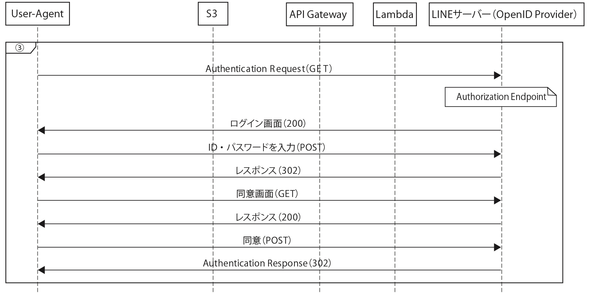

# 正誤表

紙媒体の本をご購入された方は、お手数ですが以下の正誤表をご確認ください。

電子版は修正済みのものが配信されております。

## 82ページ

**修正前**

`cd .../line-api-handbook-master/chapter07/code/lambda`

**修正後**

`cd <コードをダウンロードしたディレクトリ>/line-api-practical-guide/chapter2/code/lambda`

## 103ページ（シーケンス図）

**修正後**

## 110ページ（1つ目）

**修正前**

65 〜 75 行目:ログインに失敗した場合は以下のようなリクエストが戻されるので、パラメーターに「error」 という項目があった場合はそのエラー内容を出力(64 行目)してからエラーページへリダイレクトします。

`state=fb950061bb965......ccc976414340d3; nonce=a649204c8aa4a......185b1400c289e`

**修正後**

65 〜 75 行目:ログインに失敗した場合は以下のようなリクエストが戻されるので、パラメーターに「error」 という項目があった場合はそのエラー内容を出力(67 行目)してからエラーページへリダイレクトします。

`https://example.com/callback?error=access_denied&error_description=The+resource+owner+denied+the+request.&state=0987poi`

## 110ページ（2つ目）

**修正前**

82 行目:Cookie を取得しています。Cookie は次のような形で送られてくるので、区切り文字「;」で分割 します。

`state=4ed77097249d0c5bddb6205483993372; nonce=fd0cb395-fb16-4392-b627-5bbbbdf82ede`

**修正後**

82 行目:Cookie を取得しています。Cookie は次のような形で送られてくるので、区切り文字「; 」で分割 します。

`state=fb950061bb965......ccc976414340d3; nonce=a649204c8aa4a......185b1400c289e`
